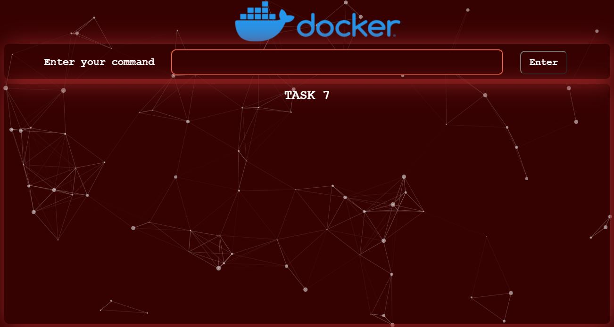

<h1>Javascript Integration with Docker</h1>

<h3>Task Description 📄</h3>

<pre>📌 In this task you have to create a Web Application for Docker (one of the great Containerization Tool
    which provides the user Platform as a Service (PaaS))by showing your own creativity and UI/UX designing 
    skills to make the webportal user friendly.</pre>

  
  <pre><strong>
  📌 This app will help the user to run all the docker commands like:
      👉docker images
      👉docker ps
      👉docker run
      👉docker rm -f
      👉docker exec
      👉 add more if you want. (Optional) 
  </strong><pre>
  
